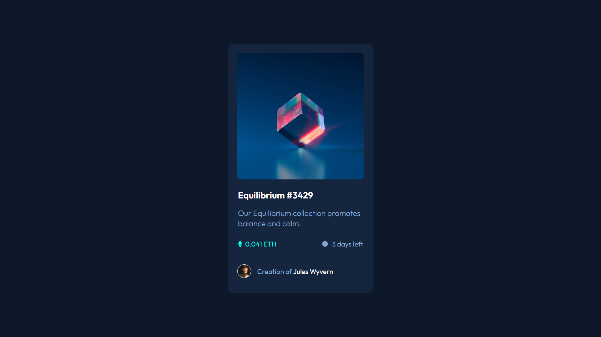
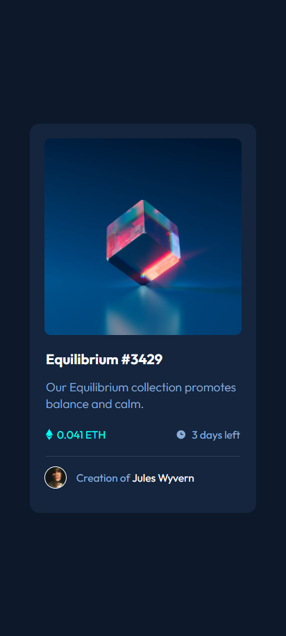

# 💎 NFT Preview Card Component

Projeto de componente visual de card NFT, desenvolvido como parte de um desafio do **Frontend Mentor**. O foco foi a criação de um card interativo com hover effects, design moderno e layout totalmente responsivo.

---

## 📌 Desafio

Construir um componente de visualização de NFT com base no layout fornecido pelo Frontend Mentor, incluindo:

- Layout responsivo;
- Animações e efeitos de hover;
- Exibição de imagem de NFT com visualização interativa;
- Informações do criador e tempo restante.

---

## ⚙️ Funcionalidades

- Efeito de hover que escurece a imagem do NFT e exibe um ícone de visualização;
- Títulos e nomes com animação de cor ao passar o mouse;
- Layout adaptável a diferentes tamanhos de tela com media queries;
- Imagem do criador exibida de forma estilizada ao lado do nome.

---

## 🛠️ Tecnologias Utilizadas

- **HTML5**
- **CSS3**

---

## 🖼️ Resultado

### 🖥️ Desktop

### 📱 Mobile

---

## 🔗 Veja no GitHub Pages

🔗 [Clique aqui para visualizar o projeto](https://inocenciooo.github.io/nft-preview-card/)
